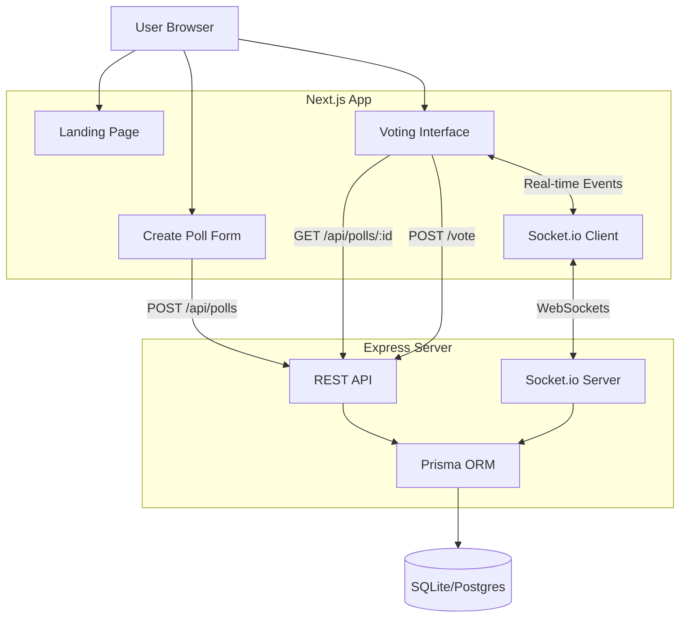

# Real-Time Polling Website

A premium, real-time polling application built with Next.js, Express, Socket.io, and Prisma.

## 🚀 Features

- **Real-Time Updates**: Votes update instantly on all connected clients using Socket.io.
- **CRED-inspired UI**: Dark mode, glassmorphism, and smooth Framer Motion animations.
- **Fairness System**: Prevents duplicate voting using:
  - **IP Tracking**: (Backend) Checks IP address per poll.
  - **Browser Fingerprinting**: (Frontend/Backend) Generates a unique hash.
- **Dynamic Poll Creation**: Add unlimited options (min 2).
- **Responsive Design**: Works on mobile and desktop.

## 🏗️ Architecture



## 🛠️ Tech Stack

- **Frontend**: Next.js 15 (App Router), Tailwind CSS v4, Framer Motion.
- **Backend**: Node.js, Express, Socket.io.
- **Database**: SQLite (Dev) / PostgreSQL (Prod), Prisma ORM.

## 🏁 Getting Started

### Prerequisites
- Node.js (v18+)
- npm

### 1. Setup Backend
```bash
cd backend
npm install
npx prisma migrate dev --name init
npm run build
npm start
```
*Server runs on http://localhost:3001*

### 2. Setup Frontend
```bash
cd frontend
npm install
npm run dev
```
*App runs on http://localhost:3000*

## 🛡️ Fairness Mechanisms

1.  **IP Address Check**: The backend records the IP address of every vote. If a vote for the same `pollId` comes from an existing IP, it is rejected.
    *   *Limitation*: Users behind a NAT (like a corporate office) might share an IP.
2.  **Browser Fingerprint**: The frontend generates a persistent random hash stored in LocalStorage. This is sent with the vote.
    *   *Limitation*: Tech-savvy users can clear LocalStorage.

## ⚠️ Known Limitations
- Background images for the "Grid" are replaced with CSS for portability.
- SQLite is used for development ease; switch `provider` in `schema.prisma` to `postgresql` for production.
- Backend might need `npm run build` if `ts-node` fails in some environments.
